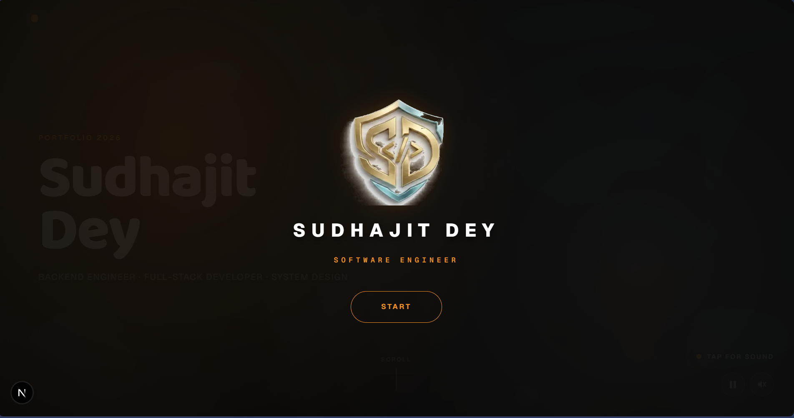
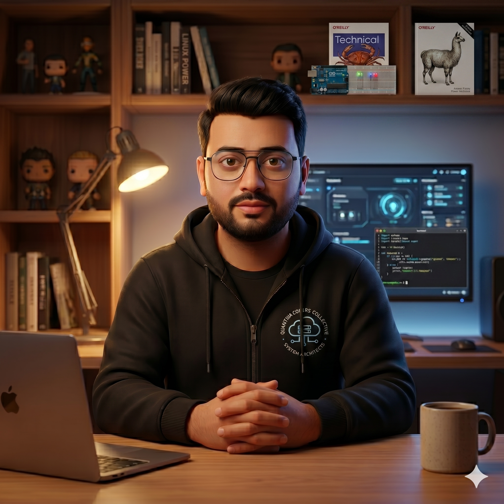

# Cinematic Portfolio

A cinematic, data-driven portfolio for Sudhajit Dey, built with Next.js 16, React 19, GSAP, Three.js, and CSS Modules.

The site is structured around full-screen portfolio sections, GSAP-controlled navigation, animated Three.js visuals, project showcases, certifications, work experience, and a sticky publications/footer experience.

## Preview





## Tech Stack

| Area | Stack |
| --- | --- |
| Framework | Next.js 16.2.6, React 19 |
| Animation | GSAP, Three.js |
| Styling | CSS Modules, global CSS tokens |
| Icons | react-icons |
| Tooling | ESLint, Playwright |

## Getting Started

Install dependencies and run the local development server:

```bash
npm install
npm run dev
```

Open [http://localhost:3000](http://localhost:3000).

Build and run the production app:

```bash
npm run build
npm start
```

Run linting:

```bash
npm run lint
```

## Project Structure

```text
app/                  Next.js App Router pages, layout, metadata, global styles
components/           Portfolio sections, UI pieces, and Three.js components
components/three/     Browser-only Three.js experiences
data/profile.json     Portfolio identity, experience, projects, skills, socials
data/content.json     Reusable section copy and UI labels
lib/                  Shared configuration and GSAP setup
public/assets/        Images, videos, logos, and project media
public/favicons/      Icons and web app manifest assets
```

## Content Updates

All personal portfolio data should be edited in `data/profile.json`, including:

- Name, email, tagline, bio, location, and availability
- Skills, work experience, projects, certifications, and social links

Reusable section text lives in `data/content.json`.

Site metadata and JSON-LD should use `SITE_URL` from `lib/siteConfig.js`. Update that value before deploying to production.

## Styling

Global design tokens live in `app/globals.css`. Component-specific styles should stay in CSS Modules.

Do not add CSS scroll snap. Section navigation is controlled by `goTo(idx)` in `app/page.js` through GSAP.

## Assets

Replace or update media in `public/assets/` as needed. Key assets include:

- `hero.png`
- `profile.png`
- `Portfolio.png`
- `my_standing_pic.jpg`
- `work-experience.webp`
- `footer.png`
- `footer-mobile.webp`
- `footer-video.mp4`
- Project images referenced from `data/profile.json`

## Deployment

The app is ready for deployment on Vercel or any platform that supports Next.js.

For Vercel, connect the repository and use the default Next.js settings. Before publishing, confirm:

- `lib/siteConfig.js` has the correct production URL
- `data/profile.json` has final portfolio content
- Favicons and manifest assets are current

## License

Private portfolio project. Update this section if you intend to publish it under an open-source license.
